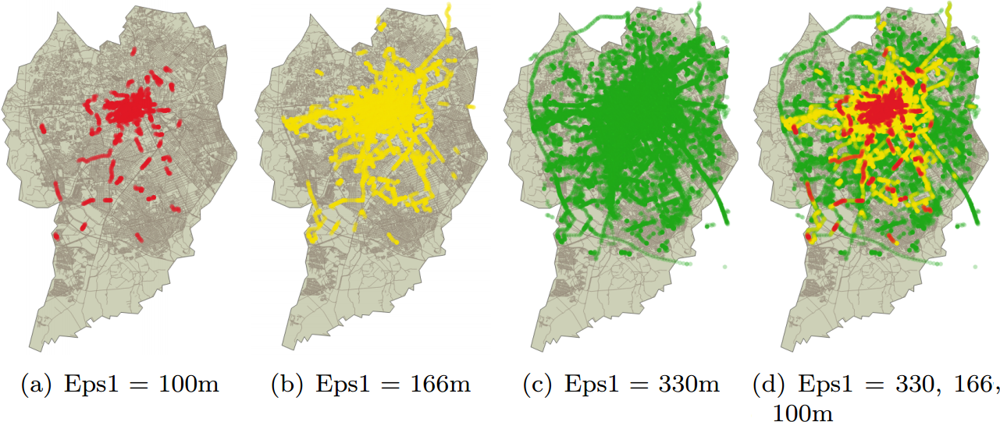

# py-st-dbscan
An implementation of ST-DBScan algorithm using Python language. For more 
information, see the paper:

```
Birant, D. and Kut, A. (2007). St-dbscan: An algorithm for clustering 
spatial–temporal data. Data & Knowledge Engineering, 60(1):208 – 221. 
Intelligent Data Mining.
```
# Related work

DBSCAN is a spatial density-based clustering algorithm for applications with
noise. This algorithm does not require the number of clusters, this value is
identified based on the quantity of highly density connected components. The
required parameters are the radius and the minimum number of neighbors.

From these parameters, clusters with different formats and the same density,
are found [Sander et al., 1998]. This algorithm can be applied in several 
contexts in which the identification of densely connected components is desired 
(e.g., delimitation of deforested regions and identification of areas of organs 
affected by tumors). In all these contexts, clusters are identified considering 
spatial characteristics of the elements.

We can find many variations of DBSCAN in the literature, one of these
is ST-DBSCAN, which takes into account both spatial and non-spatial aspects
(e.g., temperature, color, or time) of the elements [Birant and Kut, 2007]. However,
in this work ST-DBSCAN is used for identifying traffic congestions from
geospatial data provided by an application of taxi calling.
In this context, many efforts have been made to identify traffic congestion
using clustering algorithms. In [Kianfar and Edara, 2013], the efficiency of Kmeans,
Hierarchical Clustering, and Gaussian Mixture Models (GMM) were
compared identifying congested and free roads. In the other way, 
[Liu et al., 2010] developed an algorithm called Mobility-Based Clustering 
for find agglomerations of mobile objects (e.g., taxis) in cities. They defend 
that vehicle speed can be predicted through its accumulation.
Finally, a deep learning method, called Restricted Boltzmann Machine,
was proposed for predicting traffic conditions from data generated by taxi GPS
in order to recommend roads for taxi drivers [Niu et al., 2015].


## Sample application Traffic Congestion Detection using Taxi Position

Traffic congestion is a frequent situation in urban centers nowadays. It occurs 
because the urban infrastructure can not keep up with the growth of the number 
of vehicles. Thus, it causes many drawbacks, such as stress, delays, and 
excessive fuel consumption. This application aims to identify traffic 
congestions using the geographic position of taxis provided by GPS. 

We assume that a vehicle speed can be estimated by its position in different 
times. Thus, we applied a density clustering algorithm, which takes into account 
both spatial and non-spatial aspects [R3], to identify traffic congestions from 
taxi positions.




## Reference 
[Birant and Kut, 2007] Birant, D. and Kut, A. (2007). St-dbscan: An algorithm
for clustering spatial–temporal data. Data & Knowledge Engineering,
60(1):208 – 221. Intelligent Data Mining.

[Sander et al., 1998] Sander, J., Ester, M., Kriegel, H.-P., and Xu, X. (1998).
Density-based clustering in spatial databases: The algorithm gdbscan and its
applications. Data Min. Knowl. Discov., 2(2):169–194

[Liu et al., 2010] Liu, S., Liu, Y., Ni, L. M., Fan, J., and Li, M. (2010). 
Towards mobility-based clustering. In Proceedings of the 16th ACM SIGKDD
International Conference on Knowledge Discovery and Data Mining, KDD
’10, pages 919–928, New York, NY, USA. ACM.
